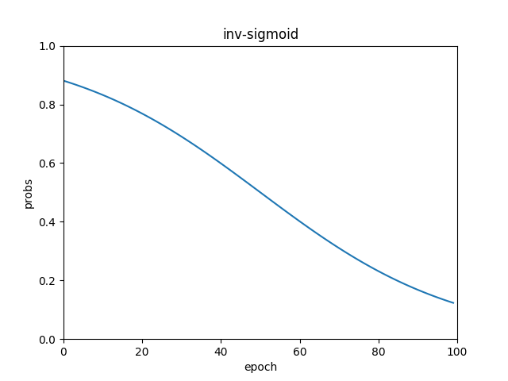
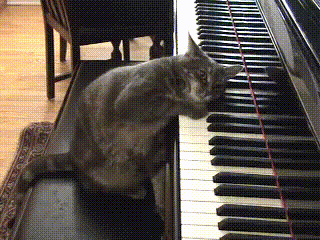
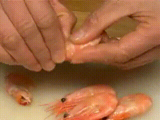
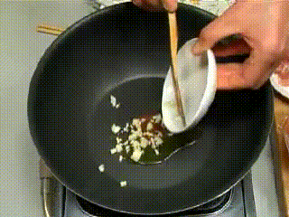

# S2VT 

Video Captioning (seq2seq)


## Best BLEU Score

BLEU:`0.72434`

Epoch 99, step 95/96, (Training Loss: 2.0834, samp_prob: 0.1235) [4:07:06<00:00, 148.26s/it]


## saver

The model `save_net.ckpt-9407.data-00000-of-00001` is quite large, you are suggested to download the .ckpt separately. You can download this model from [here](#).


## Schedule Sampling

```
probs = 
[0.88079708 0.87653295 0.87213843 0.86761113 0.86294871 0.85814894
 0.85320966 0.84812884 0.84290453 0.83753494 0.83201839 0.82635335
 0.82053848 0.81457258 0.80845465 0.80218389 0.7957597  0.78918171
 0.78244978 0.77556401 0.76852478 0.76133271 0.75398872 0.74649398
 0.73885001 0.73105858 0.72312181 0.71504211 0.70682222 0.69846522
 0.68997448 0.68135373 0.67260702 0.6637387  0.65475346 0.64565631
 0.63645254 0.62714777 0.61774787 0.60825903 0.59868766 0.58904043
 0.57932425 0.56954622 0.55971365 0.549834   0.53991488 0.52996405
 0.51998934 0.50999867 0.5        0.49000133 0.48001066 0.47003595
 0.46008512 0.450166   0.44028635 0.43045378 0.42067575 0.41095957
 0.40131234 0.39174097 0.38225213 0.37285223 0.36354746 0.35434369
 0.34524654 0.3362613  0.32739298 0.31864627 0.31002552 0.30153478
 0.29317778 0.28495789 0.27687819 0.26894142 0.26114999 0.25350602
 0.24601128 0.23866729 0.23147522 0.22443599 0.21755022 0.21081829
 0.2042403  0.19781611 0.19154535 0.18542742 0.17946152 0.17364665
 0.16798161 0.16246506 0.15709547 0.15187116 0.14679034 0.14185106
 0.13705129 0.13238887 0.12786157 0.12346705]
```




## Correct descriptions

| `TZ860P4iTaM_15_28.avi`,a cat is playing the piano           | ****`qvg9eM4Hmzk_4_10.avi`,a man is lifting a truck       |
| ------------------------------------------------------------ | --------------------------------------------------------- |
|                         |                    |
| **`UXs3eq68ZjE_250_255.avi`,someone is is adding rice a pot** | **`0lh_UWF9ZP4_62_69.avi`,a woman is mixing ingredients** |
|                    |                   |

## Relevant but incorrect descriptions


| `778mkceE0UQ_40_46.avi`,a car is driving a a car | `PeUHy0A1GF0_114_121.avi`,a woman is the shrimp         |
| ------------------------------------------------ | ------------------------------------------------------- |
|          |               |
| **`ufFT2BWh3BQ_0_8.avi`,a panda panda is**       | **`WTf5EgVY5uU_124_128.avi`,a woman is oil onions and** |
|            |               |


## Other branches: (currently unavailable)

#### 1. Bidirectional RNN

https://github.com/AdrianHsu/MLDS2018SPRING/tree/241b127329e4dae85caaa0d294d81a1a1795cb5f

#### 2. `raw_rnn()` combined with two `dynamic_rnn()`

https://github.com/AdrianHsu/MLDS2018SPRING/tree/66bde2627a0f36360dcffa5d76583ce49514ae8a


## References

**[1] S. Venugopalan, M. Rohrbach, R. Mooney, T. Darrell, and K. Saenko. Sequence to sequence video to text. In Proc. ICCV, 2015**

http://www.cs.utexas.edu/users/ml/papers/venugopalan.iccv15.pdf

**[2] Bengio, S., Vinyals, O., Jaitly, N., and Shazeer, N. Scheduled sampling for sequence prediction with**
**recurrent neural networks. In NIPS, 2015.**

https://arxiv.org/abs/1506.03099

**[3] Thang Luong, Hieu Pham, and Christopher D. Manning. Effective Approaches to Attention based Neural Machine Translation. In EMNLP, 2015.**

https://arxiv.org/abs/1508.04025

**[4] Dzmitry Bahdanau, Kyunghyun Cho, and Yoshua Bengio. Neural Machine Translation by Jointly Learning To Align and Translate. In ICLR, 2015.**

https://arxiv.org/abs/1409.0473